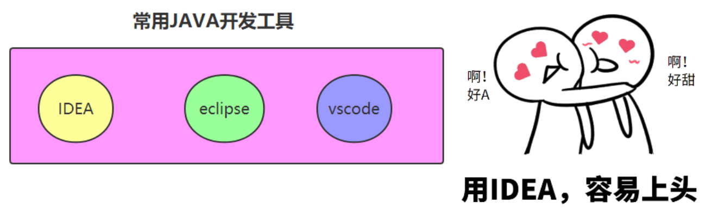

## JAVA入门和背景知识

**最全的JAVA学习路线图和就业情况分析**


**JAVA就业情况**

1. 程序员在整个中国就业市场仍然是较好的。
2. JAVA在程序员领域仍然是就业较好的。
3. 卷？什么行业不卷？


**实时效果反馈**

**1. JAVA程序员的就业情况，在各种语言中:**

A 一直较好

B 一般

C 差

D 时好时坏

**2. 企业对于JAVA程序员的要求:**

A 待遇整体越来越低，整体要求也越来越高

B 待遇整体越来越高，整体要求也越来越高

C 待遇整体越来越低，整体要求也越来越低

D 待遇整体越来越高，整体要求也越来越低

**答案**

 **1=>A 2=>B**

## 正确的学习方法

### 道理很简单，关键是坚持


有了，真的会人人练吗？人人练，真的有人坚持下去吗？

人生成功的宝典：

1. 中小学好好听课，好好作业。考211/985
2. 有几个人，顶住诱惑，坚持下去了？

就业高薪的宝典：

1. 实战课程，一节一节学，代码一行一行敲
2. 希望大家，咬着牙，坚持下去
3. 有个同学，大二开始学我们的课程，现在工作1年，年薪50万


### 守破离的学习战略


1. 守

   学习期间，照着老师的做。不急功近利，不做创新！不怀疑老师！

2. 破

   工作后，开始突破，怀疑老师！自己开始构建自己的知识体系

3. 离

   工作3年后，形成自身体系，彻底脱离老师，自成一家！

> ⚠️ 不同阶段，学习的战略思路不能错！
>
> 1. 守的阶段，天天怀疑老师，想着创出自己的路，太急躁
> 2. 破的阶段，循规蹈矩，还照着做，没出息
> 3. 离的阶段，自成体系，自成一家

### 建立知识体系为第一要务


1. 按照学习计划尽快搭建知识体系
2. 如果某一个知识点两三次都不懂，记住结论，继续往后学，不耽搁
3. 知新而温故


1. 不追求每个知识点都100%掌握。
2. 能掌握70%的知识点就很好了。
3. 能掌握每个知识点的最常见的用法就超很好了。

### 我的偶像


**实时效果反馈**

**1. 初学者碰到某个知识点听两三次课都学不懂，如下哪种方式是正确的？**

A 死磕它，我一定要100%掌握它

B 很正常，不慌张，记住结论，继续往后学。一个月后，回来看。

C 慌了，怀疑人生，怀疑自己

D 觉得自己不适合学习

**1. "守破离"学习战略思想，说法错误的是？**

A 学习期间，照着老师的做。不急功近利，不做创新！不怀疑老师！

B 守的阶段，天天怀疑老师，想着创出自己的路，太急躁

C 破的阶段，工作后，开始突破，怀疑老师！自己开始构建自己的知识体系

D 离的阶段，工作3年后，形成自身体系，彻底脱离老师，自成一家！

**答案**

1=>B 2=>B

## **常见编程语言介绍**


**C语言**

> C语言诞生于1972年，现代高级语言的鼻祖，由著名的贝尔实验室发明。
>
> 在底层编程，比如嵌入式、病毒开发等应用，可以替代汇编语言来开发系统程序。
>
> 在高层应用，也可以开发从操作系统(Linux/Windows都基于C语言开发)到各种应用软件。

**C++语言**

> 作为C语言的扩展，C++是贝尔实验室于80年代推出的。C++是一种混合语言，既可以实现面向对象编程，也可以开发C语言面向过程风格的程序。
>
> C++语言在科学计算、操作系统、网络通讯、系统开发、引擎开发中仍然被大量使用。

**Java语言**

> 由美国SUN公司(被oracle公司收购)发明于1995年，是目前业界应用最广泛、使用人数最多的语言，连续多年排名世界第一，可以称之为“计算机语言界的英语”。

> Java广泛应用于企业级软件开发、安卓移动开发、大数据云计算等领域，几乎涉及IT所有行业。关于Java的发展历史和特性，将在后面专门介绍。

**JavaScript语言**

> JavaScript是一种脚本语言,已经被广泛用于Web应用开发；应用范围越来越大，重要性越来越高。目前，前端开发核心其实就是JavaScript语言。

**Python语言**

> Python发明于1989年，语法结构简单，易学易懂；
>
> Python广泛应用于：人工智能、科学计算、web编程等。

**PHP语言**

> PHP原始为Personal Home Page的缩写，已经正式更名为 "PHP: Hypertext Preprocessor"。

> 一般用于WEB开发领域；大量的中小型网站以及某些大型网站使用PHP开发。

**Object-C和Swift语言**

> Object-C通常写作Objective-C或者Obj-C或OC，是根据C语言所衍生出来的语言，继承了C语言的特性，是扩充C的面向对象编程语言。OC主要用于苹果软件的开发。

> Swift，苹果于2014年WWDC（苹果开发者大会）发布的新开发语言，可与OC共同运行于Mac OS和iOS平台，用于搭建基于苹果平台的应用程序。

**C#(c sharp)语言**

> C#是微软公司发布的一种面向对象的、运行于.NET Framework之上的高级程序设计语言。

**Kotlin语言**

> Kotlin已正式成为Android官方支持开发语言，并且是一种可以兼容java的语言。

**Go语言**

> Go（又称 Golang）是 Google开发的一种静态强类型、编译型语言。

**Basic语言**

> 虽然易学，但功能不够强大，应用到大程序的有效性令人怀疑。已经逐步退出历史舞台。


**实时效果反馈**

**1. Java是哪个公司发明是:**

A 微软

B 华为

C SUN

D ORACLE

**答案**

1=>C

 **Java发展史 三大版本含义 Java核心优势**

---


### **Java发展简史**


1991年，James Gosling在SUN公司想要设计这样一种小型计算机语言。该语言主要用于像电视盒这样的消费类电子产品，要求语言本身是中立的，也就是跨平台的。


Java语言发展到今天经历了一系列的过程：

- 1991年，SUN公司的Green项目，Oak
- 1995年，推出Java测试版
- 1996年，JDK1.0
- 1998年，JDK1.2，大大改进了早期版本缺陷，是一个革命性的版本，更名为Java2。
- 2004年，J2SE 5.0 (1.5.0) Tiger老虎
- 2014年，JavaSE8.0
- 2017年，JAVA 9.0
- 2020年3月，JAVA14
- 2020年9月，JAVA15
- 2021年3月，JAVA16
- 2021年9月，JAVA17
- 2022年3月，JAVA18
- 2022年9月，JAVA19
- 2023年3月，JAVA20
- 2023年9月，JAVA21
- ...

> SUN公司已经被oracle公司收购，目前每半年更新一次java的版本。但是，企业中的主流仍然以8为主。对于初学者，JAVA8以上都可以。


### **Java的核心优势**

Java为消费类智能电子产品而设计，但智能家电产品并没有像最初想象的那样拥有大的发展。然而90年代，Internet却进入了爆发式发展阶段，一夜之间，大家都在忙着将自己的计算机连接到网络上。这个时侯，遇到了一个大的问题。人们发现连接到Internet的计算机各式各样，有IBM PC、苹果机、各种服务器等等，不仅硬件CPU不同，操作系统也不同，整个的网络环境非常复杂。这个时候，程序员们希望他们编写的程序能够运行在不同的机器，不同的环境中，这需要一种体系中立的语言（即跨平台）。Java的研发小组忽然发现他们用于小范围的语言也可以适应Internet这个大环境。

**跨平台是Java语言的核心优势，赶上最初互联网的发展，并随着互联网的发展而发展，建立了强大的生态体系，目前已经覆盖IT各行业的“第一大语言”，是计算机界的“英语”。**

虽然，目前也有很多跨平台的语言，但是已经失去先机，无法和Java强大的生态体系抗衡。Java仍将在未来几十年成为编程语言的主流。

### **Java各版本的含义**

**JavaSE（Java Standard Edition）：标准版，定位在个人计算机上的应用**

这个版本是Java平台的核心，它提供了非常丰富的API来开发一般个人计算机上的应用程序，包括用户界面接口AWT及Swing，网络功能与国际化、图像处理能力以及输入输出支持等。在上世纪90年代末互联网上大放异彩的Applet也属于这个版本。Applet后来为Flash取代，Flash即将被HTML5取代。

**JavaEE（Java Enterprise Edition）：企业版，定位在服务器端的应用**

JavaEE是JavaSE的扩展，增加了用于服务器开发的类库。如：JDBC是让程序员能直接在Java内使用的SQL的语法来访问数据库内的数据；Servlet能够延伸服务器的功能，通过请求-响应的模式来处理客户端的请求；JSP是一种可以将Java程序代码内嵌在网页内的技术；

**JavaME（Java Micro Edition）：微型版，定位在消费性电子产品的应用上**

JavaME是JavaSE的内伸，包含J2SE的一部分核心类，也有自己的扩展类,增加了适合微小装置的类库：javax.microedition.io.*等。该版本针对资源有限的电子消费产品的需求精简核心类库，并提供了模块化的架构让不同类型产品能够随时增加支持的能力。

> **菜鸟雷区：**
>
> 很多人开始会误解为安卓开发就是JavaME，这两个是完全不同的内容。

### **Java的特性和优势**

- **跨平台/可移植性**

这是Java的核心优势。Java在设计时就很注重移植和跨平台性。比如：Java的int永远都是32位。不像C++可能是16，32，可能是根据编译器厂商规定的变化。这样的话程序的移植就会非常麻烦。

- **安全性**

Java适合于网络/分布式环境，为了达到这个目标，在安全性方面投入了很大的精力，使Java可以很容易构建防病毒，防篡改的系统。

- **面向对象**

面向对象是一种程序设计技术，非常适合大型软件的设计和开发。由于C++为了照顾大量C语言使用者而兼容了C，使得自身仅仅成为了带类的C语言，多少影响了其面向对象的彻底性！Java则是完全的面向对象语言。

- **简单性**

Java就是C++语法的简化版，我们也可以将Java称之为“C++-”。跟我念“C加加减”，指的就是将C++的一些内容去掉；比如：头文件，指针运算，结构，联合，操作符重载，虚基类等等。同时，由于语法基于C语言，因此学习起来完全不费力。

- **高性能**

Java最初发展阶段，总是被人诟病“性能低”；客观上，高级语言运行效率总是低于低级语言的，这个无法避免。Java语言本身发展中通过虚拟机的优化提升了几十倍运行效率。比如，通过JIT(JUST IN TIME)即时编译技术提高运行效率。 将一些“热点”字节码编译成本地机器码，并将结果缓存起来，在需要的时候重新调用。这样的话，使Java程序的执行效率大大提高，某些代码甚至接待C++的效率。

因此，Java低性能的短腿，已经被完全解决了。业界发展上，我们也看到很多C++应用转到Java开发，很多C++程序员转型为Java程序员。

- **分布式**

Java是为Internet的分布式环境设计的，因为它能够处理TCP/IP协议。事实上，通过URL访问一个网络资源和访问本地文件是一样简单的。Java还支持远程方法调用(RMI,Remote Method Invocation)，使程序能够通过网络调用方法。

- **多线程**

多线程的使用可以带来更好的交互响应和实时行为。 Java多线程的简单性是Java成为主流服务器端开发语言的主要原因之一。

- **健壮性**

Java是一种健壮的语言，吸收了C/C++ 语言的优点，但去掉了其影响程序健壮性的部分（如：指针、内存的申请与释放等）。Java程序不可能造成计算机崩溃。即使Java程序也可能有错误。如果出现某种出乎意料之事，程序也不会崩溃，而是把该异常抛出，再通过异常处理机制加以处理。

**实时效果反馈**

**1. 目前企业界流行的JAVA版本是:**

A JAVA5

B JAVA6

C ==JAVA8==

D JAVA15

**2. JAVA的最核心优势是:**

A 面向对象

B 网络编程

C 稳定性

D ==跨平台==

**答案**

1=>C 2=>D

## **Java运行机制_JDK/JRE/JVM**

### **Java程序的运行机制**


1. Java首先利用文本编辑器编写 Java源程序，源文件的后缀名为.java；
2. 再利用编译器（javac）将源程序编译成字节码文件，字节码文件的后缀名为.class；
3. 最后利用虚拟机（解释器，java）解释执行。如上图所示。


计算机高级语言的类型主要有编译型和解释型两种，而Java 语言是两种类型的结合。

### **JVM、JRE和JDK**

**JVM(Java Virtual Machine):** 用于执行bytecode字节码的”虚拟计算机”。

**不同的操作系统有不同版本JVM，屏蔽了底层运行平台的差别**，是实现跨平台的核心。


**Java Runtime Environment (JRE) 包含：**Java虚拟机、库函数等。

**Java Development Kit (JDK)包含：**JRE，编译器和调试器等。


> **老鸟建议**
>
> - 如果只是要运行Java程序或者玩Minecraft这样的JAVA游戏，只需要JRE就可以。JRE通常非常小，其中包含了JVM。
> - 如果要开发Java程序，就需要安装JDK。

**实时效果反馈**

**1. 如下关于JAVA语言的描述，正确的是:**

A JAVA只有编译，没有解释

B ==JAVA既有编译，也有解释==

C JAVA只有解释

D JAVA代码可以直接在操作系统中运行

**2. 如下关于JVM的说法，==错误==的是:**

A JVM的英文全称是：Java Virtual Machine

B JVM是用于执行bytecode字节码的”虚拟计算机”

C 不同的操作系统有不同版本JVM，屏蔽了底层运行平台的差别，是实现跨平台的核心

D ==JVM包含了JRE，JRE包含了JDK==

**答案**

1=>B 2=>D

## Java开发环境搭建


我们工作和学习，以JAVA8为主。当然，也可以使用8以上的其他版本。

### **JDK下载和安装**

· **下载JDK**

[www.oracle.com/technetwork/java/javase/downloads/index.html](http://www.oracle.com/technetwork/java/javase/downloads/index.html)

· **安装JDK**

1. 选择JDK安装目录，采用默认即可（如果一定要自定义，不要包含中文路径）

**实时效果反馈**

**1. 如下JDK的说法，==错误==的是:**

A JDK的全称是： Java Development Kit

B JDK包含：JRE，编译器和调试器等。

C ==如果只是运行一个JAVA程序，需要安装JDK==

D 如果要开发JAVA程序，需要安装JDK

**答案**

1=>C

### **JDK环境变量的配置**


1. path是一个常见的环境变量，它告诉系统除了在当前目录下寻找此程序外，还可以到path指定的目录下寻找。

2. JAVA_HOME

   (1) 为以后其他软件寻找JDK做准备！（一般建议进行配置）

3. classpath不需配置!

JDK1.5以上版本，JRE会自动搜索当前路径下的类文件及相关jar文件。


**实时效果反馈**

**1. 如下关于JDK配置环境变量的说法，==错误==的是:**

A path必须配置

B JAVA_HOME强烈建议配置

C classpath可以不配置

D ==classpath必须配置==

**答案**

1=>D

 **测试JDK安装成功**

在窗口中输入命令“java -version ”。出现如下结果，则说明JDK安装成功。


### **openJDK和JDK收费问题**


2019年后，JDK8后续更新的版本就开始收费了。但是，主要针对的是企业用户，对于个人学习者没有任何影响。


由于JAVA虚拟机的规范是开放的，任何人都可以去实现它。我们常用的JDK只是oracle公司的一种具体实现，其他公司甚至个人也可以根据规范自己开发。常见的JDK有如下几种：

1. oracle JDK

2. open JDK

   免费的开源实现，以GPL License发布，很多Linux发行版中都会包含Open JDK

3. IBM、亚马逊等大公司有自己的JDK


### **本节作业**

1. 文字说明java应用程序的运行机制？
2. 完成JDK的安装、配置，并在命令行窗口中测试JDK安装成功。

**实时效果反馈**

**1. JDK8之后的版本，oracle公司开始收费，如下说法==错误==的是:**

A 收费主要针对的是企业用户，对于个人学习者没有任何影响

B open JDK 是免费开源的。企业也可以直接使用。

C IBM、亚马逊等大公司有自己的JDK，不影响

D ==学习者也需要付费==

**答案**

1=>D

## **开发第一个Java程序**


**·使用记事本，编写代码**

```java
public class Welcome{
    public static void main(String[] args){
        System.out.println("Hello world！");
    }
}
```

可在d盘下建立文件夹`mycode`，用于保存学习的代码。保存路径建议为：`d:/mycode`。保存为：`Welcome.java` （文件名必须为`Welcome`，大小写也必须一致）。


**· 中文问题：**

如果代码中有中文，则使用记事本保存时，选择：


> **菜鸟雷区**
>
> - 代码中的引号、分号必须为英文引号和分号，不能是中文全角的引号和分号。
> - 注意大小写。

·**编译（编译器创建class字节码文件）**

打开命令行窗口，进入Java文件所在目录；执行命令：javac `Welcome.java`，生成class文件。


**·解释并运行阶段**

执行：`java Welcome`（就是运行编译生成的`Welcome.class`），输出执行结果。

**实时效果反馈**

**1. 如下代码是java的helloworld程序，空白处依次填写:**

```java
public ____ Welcome{
    public static void ____(String[] args){
        _____.out.println("Hello world！")___
    }
}
```

A `class` `mian` `System` `;`

B `class` `main` `system` `;`

C `class` `main` `System` `；(中文分号)`

D `class` `main` `System` `;`

**答案**

1=>D

### 第一个程序常见错误


- 常见问题-1：提示“`javac`不是内部或外部命令……”

  

出错原因：Path变量配置错误导致没有找到`javac`命令

**解决方案:** 细心重新设置Path，配置完成后需要重新输入cmd打开命令行窗口。


- 常见问题-2：文件夹中可以看到`Welcome.java`文件，在编译时出现`javac` 找不到文件……


出错原因：可能是操作系统显示设置的问题，隐藏了文件的扩展名

**解决方案：**打开我的电脑窗口,选择【组织】à【文件夹和搜索选项】à【查看】，如图1-24所示，去掉“隐藏已知文件夹类型的扩展名”复选框中的对勾，看到文件的实际名称为Welcome.java.txt，将后缀后.txt去掉。


- 常见问题-3：NoSuchMethodError：main

出错原因：找不到main方法，应该是main方法书写有误。

**解决方案：**检查public static void main(String [] args){}是否有误。

> 碰到错误、碰到异常，要和看到美女帅哥那样兴奋! 你解决的每一个错误，都是你提高的阶梯！所谓编程经验很大程度就是指“调错的经验”。


**实时效果反馈**

**1. 如下java代码，出现错误的行号:**

```java
public Class Welcome{
    public static void mian(String[] args){
        system.out.println("Hello world！");
    }
}
```

A 1,2

B 2,3

C 2,3,4

D 1,2,3

**答案**

1=>D

### **第一个Java程序的总结和提升**


1. Java对大小写敏感。
2. 关键字class 的意思是类。Java是面向对象的语言，所有代码必须位于类里面。
3. 源文件编译后，得到相应的字节码文件，编译器为每个类生成独立的字节码文件。
4. main方法是Java应用程序的入口方法，格式固定：public static void main(String[] args) {…}
5. 一个源文件可以包含多个类。
6. 每个语句必须以分号结束，回车不是语句的结束标志，所以一个语句可以跨多行。

> **老鸟建议**
>
> - 编程时，一定要注意缩进规范；
> - 在写括号、引号时，一定是成对编写，然后再往里插入内容。

**实时效果反馈**

**1. 如下关于java的基本语法说明，错误的是:**

A Java对大小写，不敏感。

B Java是面向对象的语言，所有代码必须位于类里面

C 源文件编译后，得到相应的字节码文件，编译器为每个类生成独立的字节码文件

D 每个语句必须以分号结束，回车不是语句的结束标志，所以一个语句可以跨多行

**答案**

1=>A

### **最常用DOS命令**


磁盘操作系统（Disk Operating System），是早期个人计算机上的一类操作系统。

常用命令：

| 命令   | 使用说明                       |
| ------ | ------------------------------ |
| cd     | 目录路径 进入一个目录          |
| cd ..  | 进入父目录                     |
| dir    | 查看本目录下的文件和子目录列表 |
| cls    | 清除屏幕命令                   |
| 上下键 | 查找敲过的命令                 |
| Tab键  | 自动补齐命令                   |


**实时效果反馈**

**1. 如下dos命令，说明错误的是:**

A `cd d:/javacode` 进入`d:/javacode`目录

B `cd ..` 进入根目录

C `dir` 查看本目录下的文件和子目录列表

D `cls` 清除屏幕命令

**答案**

1=>B

### **常用Java开发工具**




入门学习时，进行简单的Java程序编写，我们可以使用文本编辑器，比如：记事本。但是，记事本功能不够强大，我们可以考虑使用“更加强大的记事本”，常见的有如下三种软件：

- Notepad++
- Sublime
- EditPlus


在我们真正学习开发中，包括在企业中从事软件开发时，一般使用**集成开发环境** （IDE）

- IDEA 官方网址： http://www.jetbrains.com/idea/
- VS Code 官方网址：https://code.visualstudio.com/
- eclipse 官方网址：[http://www.eclipse.org](http://www.eclipse.org/)

> **老鸟建议：**
>
> 对于IDE的选用，真的是无所谓的，大家不用太过纠结。

### **本节作业**

1. 使用记事本完成第一个Java程序的开发
2. 使用多行system.out.println()，打印如下诗句：

要说技术哪家强，

当属中国尚学堂。

学堂一支穿云箭，

万水千山来相见。

**实时效果反馈**

**1. 如下哪个不是java的开发环境:**

A IDEA

B eclpse

C VS code

D pycharm

**答案**

1=>D