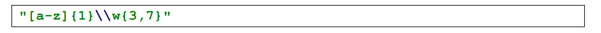
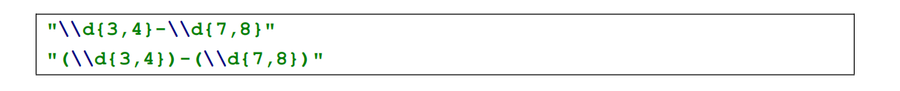
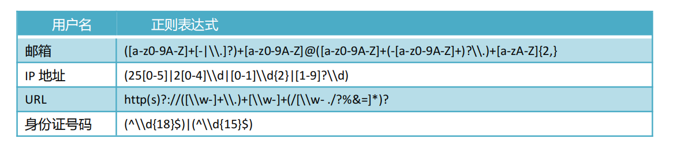

## 正则表达式

## 正则表达式介绍

###  **什么是正则表达式**

正则表达式，又称规则表达式。（英语：Regular Expression，在代码中常简写为 regex、regexp 或 RE），是计算机科学的一个概念。正则表达式通常被用来检索、替换那些符合某个模式(规则)的文本。正则表达式并不仅限于某一种语言，但是在每种语言中有细微的差别。

###  **正则表达式的作用**

正则表达式是对字符串操作的一种逻辑公式，就是用事先定义好的一些特定字符、及这些特定字符的组合，组成一个“规则字符串”，这个“规则字符串”用来表达对字符串的一种过滤逻辑。使用特殊语法来表示字符类、数量限定符和位置关系,然后用这些特殊语法和普通字符一起表示一个模式。

###  **正则表达式特点**

🔴 灵活性、逻辑性和功能性非常的强；

🟢 可以迅速地用极简单的方式达到字符串的复杂控制

🟡 对于刚接触的人来说，比较晦涩难懂

## Java 中正则表达式的使用

在 Java 中**正则表达式为 String 类型**，**被验证的内容同样为 String 类型**。通过 **String 类中的 ==matches 方法==**实现内容的匹配校验。

如：==“被验证内容”.matches(“正则表达式”)==

## 正则表达式语法规则

正则表达式语法规则：**==[内容限定]{长度限定}==**

###  **内容限定**

在定义限定内容规则时，**如果没有指定长度限定，那么==默认长度为 1。==**

#### **单个字符限定**

[a]:表示当前内容必须是字母 a

####  **范围字符限定**

[a-z0-9]:表示内容可以是 a-z 之间的任意字母或者 0-9 之间的任意数字，不分先后。

####  **取反限定**

[^abc]：表示内容不能为a或b或c

###  **长度限定**

在正则表达式中通过{ }来限定内容长度。

固定长度：{固定长度值}

范围长度：{最小长度值，最大长度值}

[a-z]{5}：表示内容范围为小写字母 a 到 z 且长度必须为 5

[a-z]{2,8}：表示内容范围为小写字母 a 到 z 且长度在 2 到 8 之间，包含 2 与 8

[a-z]{2,}：表示内容范围为小写字母 a 到 z 且最小长度为 2，最大长度无限制

[a-z]{0,2}：表示内容范围为小写字母 a 到 z 且最小长度为 0，最大长度为 2

### **长度限定符号**

长度限定符号是指通过预定义符号来完成长度限定。

?：零次或一次。等同于{0,1}

+：一次或多次。等同于{1,} 

*：零次或多次。等同于{0,}

### **预定义字符**

在正则表达式中可以通过一些预定义字符来表示内容限定。目的是为了简化内容限定的定义。

常见的预定义字符：

| 字符               描述 |                                                          |
| ----------------------- | -------------------------------------------------------- |
| ==\d==                  | ==匹配一个数字字符，等价于[0-9]。==                      |
| ==\D==                  | ==匹配一个非数字字符，等价于[ ^0-9]。==                  |
| \n                      | 匹配一个换行符。                                         |
| \r                      | 匹配一个回车符。                                         |
| \s                      | 匹配任何空白字符，包括空格、制表符、换页符等等。         |
| \S                      | 匹配任何非空白字符。                                     |
| \t                      | 匹配一个制表符。                                         |
| ==\w==                  | ==匹配包括下划线的任何单词字符。等价于“[A-Za-zO-9 ]”。== |
| \W                      | 匹配任何非单词字符。等价于“[ ^A-Za-z0-9  ]”。            |

### **正则表达式的组合定义**

在正则表达式中可以通过多个内容限定与长度限定来组合定义。

示例：

必须是以字母开头，最少长度为 4,最大长度为 8。

校验带有区号的电话号码的正则表达式

## 常见的正则表达式

